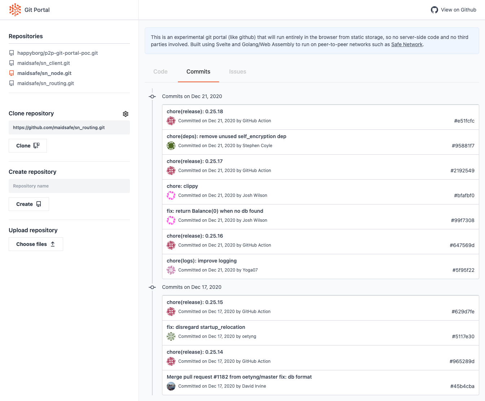

# p2p Git Portal Prototype

Git Portal is a github style sharing and collaboration application without server side code (no-backend).

- The aim is to provide an alternative to the centralisation of github and similar third party hosted services, and to avoid the need to self host such a service.
- The approach is to provide web front end in a static application which can run in a browser directly from static or peer-to-peer storage without the need for server side code.
- The benefit of this will be the convenience of a web application, without dependence on a third party and avoiding the vulnerabilities associated with servers and centralised services.

In just a few weeks this project as received a lot of encouragement which has been amazing!

**Hashtag #gitportal:** [Mastodon](https://mastodon.technology/web/timelines/tag/gitportal) | [Twitter](https://twitter.com/hashtag/gitportal)

**Chat (matrix/element):** [#gitportal](https://riot.im/app/#/room/#gitportal:matrix.org)

**Forum (discourse):** [Git Portal Discussion](https://safenetforum.org/t/safenetwork-git-portal-discussion/32793?u=happybeing)

## Proof-of-Concept
A proof-of-concept has been developed in the repository [p2p-git-portal-poc](https://github.com/happyborg/p2p-git-portal-poc) as shown below, and a live demo is available at http://gitch.happybeing.com.



### Proof-of-Concept Features
The proof-of-concept is a static HTML no-backend app (so no-server side code). 

You can create or upload repositories immediately using the buttons provided, but in order to clone a repository need to use a proxy or a browser plugin to avoid problems with CORS checks in the browser. A proxy is necessary for github, but a browser plugin is enough for some git services such as gitlab. See the [section on CORS](#setup-a-cors-proxy) if you wish to try out the clone feature.

Once you have a repository stored in Git Portal you will be able to browse the file worktree and .git directories, view commits (if any), and view issues (a few example issues are added when you create a new repository).

The UI does not yet allow you to create or edit issues.
## Git Portal Prototype
Following on from the proof-of-concept, we are developing a Git Portal prototype using an improved architecture. Like the proof-of-concept, this will run from static web hosting or from the peer-to-peer storage such as [Safe Network](https://safenetwork.tech) (a secure, anonymous, private peer-to-peer storage and communications platform). 
## Development Approach
Svelte has been selected for the front-end because it is very productive, performant and easy to learn. Even if you haven't used Svelte before I think you'll enjoy the experience and find it easy to contribute to front-end work.

Where possible business-logic will be compiled to WASM because this produces fast, compact code and allows us to develop in Rust which is productive, reduces scope for bugs and improves security.

To speed development we use existing libraries as much as possible, leaving the option to re-write or replace them later. For `git` functionality we may use JavaScript implementations in the short term, though will prefer Rust when suitable modules are available. Extensions for git issues, pull requests and additional business logic will be implemented in Rust.

To develop `git` functionality in a mixture of JavaScript and Rust we require a common filesystem in the browser. For this I evaluated Emscripten and WASI (Web Assembly System Interface) and selected the latter because it is well supported in Rust based on WasmerJS + `wasm-bindgen`. It will also I think be easier and generally more useful when migrating from the browser filesystem to a peer-to-peer filesystem for the production version.

An initial [proof-of-concept](https://github.com/happyborg/p2p-git-portal-poc) was developed in a few weeks using Go/WASM in order to extend `git` functionality with issues using `git-bug` (a Go application). From here we will re-implement selected `git-bug` features in Rust. The Rust implementation will retain compatibility at the filesystem level in order to make use of `git-bug`'s proven design, continued enhancements (e.g. to support git PRs), and excellent command line interface (as a 'git extra').
## Git Portal Prototype Summary
### Architecture

- Svelte UI with Rust/WASI and JavaScript business logic
- *in the browser*, no-server (no-backend)
### Features
- initialise, clone or upload repository 
- list repositories
- select and interact with a repository
- browse the worktree, commits and issues
- create/view/edit issues and comments

## Current Status

We have the Go/WASM based [proof-of-concept](https://github.com/happyborg/p2p-git-portal-poc) featuring most of the above functionality and a live demo at http://gitch.happybeing.com.

The Svelte Rust/WASI and JavaScript framework has been tested (here: [svelte-wasi-with-rust](https://github.com/happybeing/svelte-wasi-with-rust)) and work is now in progress in this repository to implement the initial features in this new architecture.

So there's plenty to do in all areas, including some in the first proof-of-concept related to enhancing the features and using this to advance the front-end until this WASI prototype catches up.
### Activity & Opportunities to Help

#### Proof-of-Concept
- **Features and UI** - Work continues to extend and improve functionality and UI based on the proof-of-concept: Go/Wasm no-backend, and Svelte/Tailwind CSS front-end. Suggestions and discussion of UI/UX are welcome on [#issue 1](https://github.com/happybeing/p2p-git-portal-poc/issues/1). **Help is welcome** with several small tasks in Svelte front-end and Golang no-server no-backend, but these are not yet written down. So ask if you may be able to help and I will begin to turn my thoughts into tasks with your prompting. Bigger tasks will flow from this if you want to help design or implement the features and API providing these to the front-end. 
#### Git Portal Product - Top Level Tasks
In no particular order:
- [ ] adapt WASI demo architecture for this project ACTIVE
- [ ] migrate UI from proof-of-concept
- [ ] identify suitable `git` functionality ACTIVE
- [ ] design an API to support front-end
- [ ] develop `gitbug-rs` with selected `git-bug` features
- [ ] select and implement test frameworks for JS and Rust
- [ ] fill out section below on documentation procedures
### Git Portal Vision

From a peer-to-peer alternative to github and similar third party git portal services, we will develop our vision for a community driven and oriented feature set with our own visual identity. This means re-inventing the git portal without the goal of centralisation, and instead to share and return value created by the community in whatever ways the community can benefit.

# Development Setup
## Prerequisites
As well as NodeJS and Rust you need the Rust `wasm32-wasi` target:
```bash
rustup target add wasm32-wasi
```
And the `wasm-bindgen` CLI:
```bash
cargo install wasm-bindgen-cli
```
**Note:** make sure `wasm-bindgen --version` matches the version of the `wasm-bingen` module in `Cargo.toml` (/src/rust-wasi-example/Cargo.toml). If the versions don't match after doing `cargo install wasm-bindgen-cli && wasm-bindgen --version`, modify the version referred to in `Cargo.toml` to match the CLI.

You should only need the first and second parts of the version to match, so for example `wasm-bindgen --version` of 'wasm-bindgen 0.2.69' should work fine with Cargo.toml 'wasm-bindgen = "^0.2"').
## Get the Code
If you don't have `yarn` use `npm run` instead of `yarn` in the following:
```bash
git clone https://github.com/happybeing/p2p-git-portal-wasi
cd p2p-git-portal-wasi
yarn && yarn dev-wasm-bindgen && yarn dev
```
Once the development build completes you can visit the app at localhost:8080.

# Building
## Release Build
To build for release:
```bash
yarn && yarn build
```
To test, use `yarn serve public` and visit `localhost:5000`

To deploy, upload everything in /public
## Development Build
To re-build the wasm and serve the result:
```bash
yarn dev-wasm-bindgen
yarn dev
```	

If you have `inotifywait` (e.g. on Linux) you can use `yarn dev` and `yarn watch-wasm-bindgen` together, and changes to any part of the app including the Rust subsystem will automatically re-build everything and reload the browser.

To do this, in one terminal watch and re-build the app with:
```bash
yarn dev
```
Then in another terminal, watch and re-build the Rust subsystem with:
```bash
yarn watch-wasm-bindgen
```

If you're using VSCode, we recommend installing the offical Svelte extension as well as the offical Rust extension. If you are using other editors, your may need to install a plugin in order to get syntax highlighting and intellisense for both Svelte and Rust.
### Testing
The above is all that's needed to test and for most development.

Make sure you have the proxy running and make sure the proxy URI is set correctly in the UI. Now click "Clone". 

A sample repository is already set in the UI, and should be cloned in a few seconds. Large repositories will of course take much longer, so be prepared to wait!

When cloning is finished this the list of repositories on the top left, and the list of commits on the right will be updated. If you have more than one repository cloned, you can click on the list (top left) to show the commits for that repository.

If you have problems, open the web browser console to look for any error messages and feel free to open an issue if you have difficulties.

Note: drag and drop of files is not properly supported yet.

### Code Documentation

TODO

### Contributions
If you wish to build or contribute to the code, get in touch and I'll add some build instructions as it requires some special setup using my fork of a webpack wasm plugin. Not hard, but not obvious!

## LICENSE

Everything is GPL3.0 unless otherwise stated. Any contributions are accepted on the condition they conform to this license.

See also [./LICENSE](./LICENSE)
